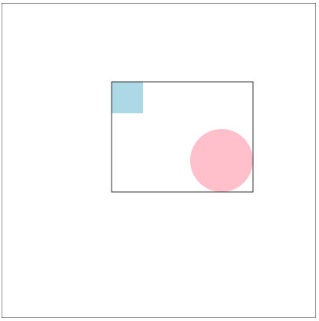

# Kata Frame

<!-- start:apropos -->
> **À propos**
>
> ⓘ Ce dépôt contient un [kata], c'est à dire un _exercice de programmation_
> généralement utilisé dans le cadre d'un [coding dojo]. Il est proposé aux
> membres du dojo de l'[EPFL] et fait partie d'une collection de différents
> katas identifiés par le topic **[epfl-dojo-kata]** sur GitHub.
>
> Comment participer ?
>
>  - Réalisez le kata dans le langage de programmation de votre choix.
>  - Ajoutez-vous à la liste des participants en proposant une [pull request].
>  - Partagez votre intérêt pour ce dépôten lui ajoutant une ⭐.
>  - Proposez des suggestions ou signalez des bugs en ouvrant une issue.
>
> Bonne lecture et bon code !

[kata]: https://fr.wikipedia.org/wiki/Coding_dojo#Kata
[coding dojo]: https://fr.wikipedia.org/wiki/Coding_dojo
[EPFL]: https://www.epfl.ch
[epfl-dojo-kata]: https://github.com/topics/epfl-dojo-kata
[Pull Request]: https://docs.github.com/en/pull-requests/collaborating-with-pull-requests/proposing-changes-to-your-work-with-pull-requests/about-pull-requests

<!-- Texte mis à jour en juin 2025 -->
<!-- end:apropos -->


## But

On positionne un rectangle et un cercle dans un espace de 500 par 500. L'origine
de cet espace (`x: 0`, `y: 0`) est situé en haut à gauche. Le rectangle est
défini par `x`, `y`, `width` et `height`. Le cercle est défini par `cx`, `cy` et
`r`.

Le but de ce kata est de délimiter la zone occupée par le rectangle et le cercle
en les encadrant. Ce cadre (de forme rectangulaire) est définit par `x`, `y`,
`width` et `height`. Si le rectangle ou le cercle déborde de l'espace de base
(500x500), alors on retourne `false`.

Voici un exemple :  
  
D'autres exemples de placement sont disponibles dans le fichier
[example.html](./example.html).


## Réalisation

Il y a différents moyen de réaliser ce kata. Une possibilité est de le faire en
ligne de commande, en reprenant les données ci-dessous et en listant la réponse:
```
    Input:
      rect = {x: 425, y: 425, width: 50, height: 50}
      circ = {cx: 125, cy: 125, r: 100}
    Output: 
      {x: 25, y: 25, width: 450, height: 450}
```

Une autre possibilité est de faire une solution
graphique, par exemple en utilisant des lirairies SVG
(https://fr.wikipedia.org/wiki/Scalable_Vector_Graphics). On pourrait alors
imaginer que l'utilisateur puisse inétragir avec le graphique, pour positionner
le rectangle et le cercle, de manière aléatoire ou non, puis cliquer sur un
bouton pour visualiser le cadre.


## Données de tests

Le fichier [example.html](./example.html) liste une série de cas de tests, qui
peuvent être utilisés pour valider votre code. Placer de manière aléatoire un
cercle et un rectangle dans le canvas est la voie à suivre.

```
// Exemple 1 : Le cercle chevauche le rectangle
Input:
  rect = {x: 150, y: 25, width: 325, height: 250}
  circ = {cx: 150, cy: 350, r: 125}
Output:
  {x: 25, y: 25, width: 450, height: 450}

// Exemple 2 : Le cercle est séparé du rectangle
Input:
  rect = {x: 425, y: 425, width: 50, height: 50}
  circ = {cx: 125, cy: 125, r: 100}
Output:
  {x: 25, y: 25, width: 450, height: 450}

// Exemple 3 : Le cercle est à l'intérieur du rectangle
Input:
  rect = {x: 25, y: 25, width: 450, height: 450}
  circ = {cx: 250, cy: 250, r: 125}
Output:
  {x: 25, y: 25, width: 450, height: 450}

// Exemple 4 : Le rectangle est à l'intérieur du cercle
Input:
  rect = {x: 75, y: 125, width: 350, height: 250}
  circ = {cx: 250, cy: 250, r: 225}
Output:
  {x: 25, y: 25, width: 450, height: 450}

// Exemple 5 : Le cercle est séparé du rectangle
Input:
  rect = {x: 175, y: 125, width: 50, height: 50}
  circ = {cx: 350, cy: 250, r: 50}
Output:
  {x: 125, y: 125, width: 225, height: 175}

// Exemple 6 : Le cercle dépasse du canvas
Input:
  rect = {x: 150, y: 25, width: 325, height: 250}
  circ = {cx: 150, cy: 350, r: 225}
Output:
  false
```


## Je l'ai fait 💪

* La version de [@octocat](https://github.com/octocat) a été faite en `langage`
  et est disponible [ici](https://#).


## Pour aller plus loin
https://developer.mozilla.org/en-US/docs/Web/SVG/Tutorial/Basic_Shapes
https://developer.mozilla.org/en-US/docs/Web/SVG/Tutorial/Positions
